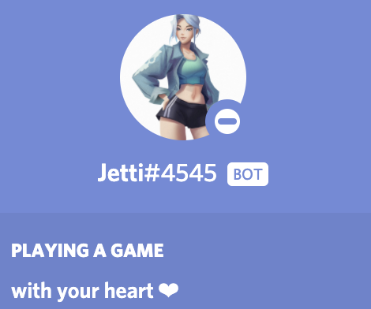
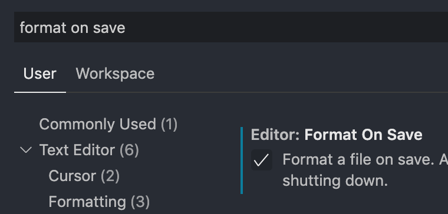

<p align="center">
   
</p>
<p align="center">
   <b>Custom game teams builder for Valorant & League of Legends</b>
</p>
<p align="center">
   <a href="https://playvalorant.com/en-gb/">
      
   </a>
   <a href="https://na.leagueoflegends.com/en-gb/">
      
   </a>
   <a href="https://discord.com/">
      
   </a>
   <a href="https://github.com/Glup3/Jetti/graphs/contributors">
      
   </a>
   <a href="https://github.com/glup3/jetti/blob/main/LICENSE.txt">
      
   </a>
   <a href="https://github.com/glup3/jetti/releases">
      
   </a>
</p>

## About The Project

`Jetti` creates balanced teams for you to play fair custom games in `Valorant` or `League of Legends`. All you have to do is add your players to the database.

```
// add player to database
!add-player @user <skillLevel>
```

Now you can build teams by:

```
// pinging 10 players
!build @user1 @user2 @user3 @user4 @user5 @user6 @user7 @user8 @user9 @user10

// or by simply just having 10 players in the voice chat
!build

// you can also ping your missing players
// example | 8 in voice chat, 2 are missing:
!build @user9 @user10
```

`Jetti` can also save Teams and Matches. Upload a screenshot of the scoreboard at the end of the game to record your cool gamer moments!

Create Teams (returns `TeamID`)

```
!add-team <TeamName1> @user1 @user2 @user3 @user4 @user5
!add-team <TeamName2> @user1 @user2 @user3 @user4 @user5
```

Create Match between two Teams (returns `MatchID`)

```
!add-match <TeamID1> <TeamID2>
```

Upload the scoreboard

```
!screenshot <MatchID>
```

### Built with

All the cool technologies we used:

- TypeScript
- Discord.js
- Discord.js Commando
- ~~Sequelize~~
- ~~Sqlite & Postgres~~
- Heroku
- GraphQL
- GraphQL-Codegen

## Getting Started

### Prerequisites

- nodeJS (v12.0 or higher)
- [Discord Bot Application](https://discordpy.readthedocs.io/en/latest/discord.html)

#### Bot Permissions

This section lists all permissions the bot needs in order to function properly.

1. `Send Messages`: Required, Jetti responds via messages
2. `Move Members`: Optional, Jetti can move players into voice channels

### Installation & Usage

1. Clone or download the repo

   ```
   $ git clone https://github.com/Glup3/Jetti.git
   ```

2. Install NPM packages

   ```
   $ npm install
   ```

3. Create an `.env` file in the root folder and enter the secrets

   ```
   BOT_OWNER=12312312423321
   BOT_TOKEN=YOUR_SUPER_SECRET_BOT_TOKEN_YOU_SHOULD_NEVER_SHARE
   ```

4. Run the discord bot locally

   ```
   $ npm start
   ```

### View Postgres DB with GUI

I use [pgweb](http://sosedoff.github.io/pgweb/) as GUI for our postgres instance. Can be installed for all operating systems. (I use MacOS)

```
pgweb --host localhost
```

### View Heroku Postgres DB in pgweb

```
heroku config:get DATABASE_URL -a <HEROKU_APP_NAME> | xargs pgweb --url
```

## Skill Level Formula

Every player gets a skill level (weight). They are from 1 to 6 (low to high).

- Level 1 = Iron
- Level 2 = Bronze
- Level 3 = Silver
- Level 4 = Gold
- Level 5 = Platinum
- Level 6 = Diamond
- Level 7 = Immortal
- Level 8 = Radiant

while no fair teams:

1. create two random teams
2. sum up skill levels for each team
3. compare total skill level
   1. if difference of 1 --> fair teams
   2. else go to step 1

## Commands

Use the command `!help` to get more information about all available commands.

## Resources

- https://discordpy.readthedocs.io/en/latest/discord.html
- https://discordjs.guide/commando/
- https://discordjs.guide/
- https://github.com/discordjs/discord.js
- https://discord.js.org/#/
- https://github.com/RobinBuschmann/sequelize-typescript#usage
- https://dev.to/anayooleru/modifying-an-existing-sequelize-migration-1mnn
- https://stackoverflow.com/questions/51509499/how-do-i-view-a-postgresql-database-on-heroku-with-a-gui

## Developer Environment

Best Editor: [VS Code](https://code.visualstudio.com/)

Other choices:

- Atom
- Sublime
- Webstorm
- VIM
- ...

### Plugins for VS Code

- [ESLint](https://marketplace.visualstudio.com/items?itemName=dbaeumer.vscode-eslint)
- [Prettier](https://marketplace.visualstudio.com/items?itemName=esbenp.prettier-vscode)
- [Bracket Pair Colorizer 2 (Recommendation)](https://marketplace.visualstudio.com/items?itemName=CoenraadS.bracket-pair-colorizer-2)
- [Material Icon Theme (Recommendation)](https://marketplace.visualstudio.com/items?itemName=PKief.material-icon-theme)
- [One Dark Pro (Recommendation)](https://marketplace.visualstudio.com/items?itemName=zhuangtongfa.Material-theme)

### Autoformat On Save:

1. Press `Ctrl + ,` (Settings UI) or `Ctrl + Shift + P` > `Open Settings (UI)`

2. Search for `format on save`

3. Tick the box with the title `Editor: Format On Save`
   

## Roadmap

See the [open issues](https://github.com/Glup3/Jetti/issues) for a list of proposed features (and known issues).

## License

Distributed under the MIT License. See `LICENSE` for more information.

## Contributors

- Glup3 | Phuc Tran
- Sicari-s
- Easyzsz
